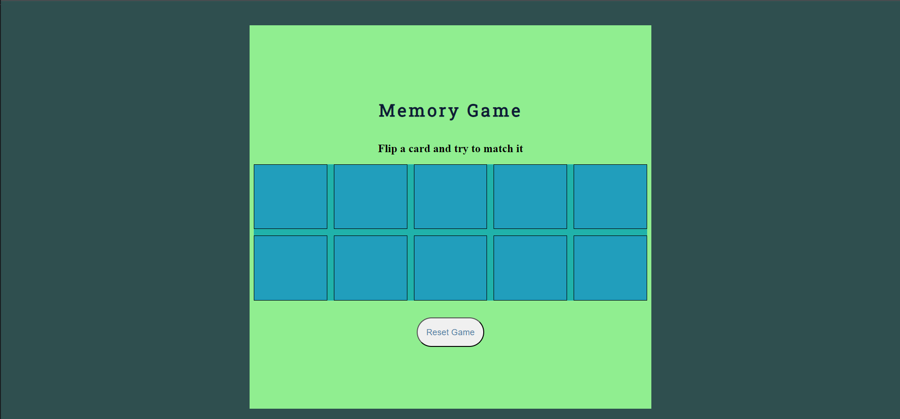
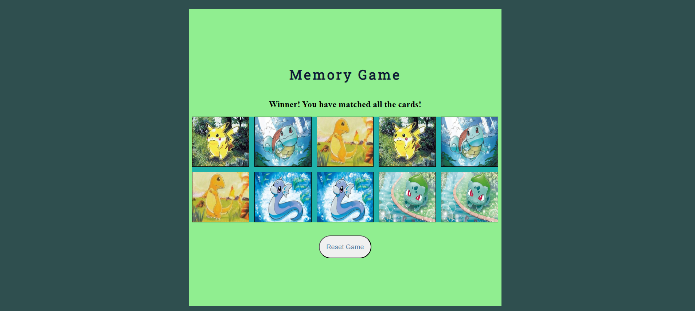

# Project-1-Memory
#  Memory Game:
##  Pick one of the ten cards, after selecting your first card an image of a pokemon will appear. Try and find it's match. If you fail to match the first picked card with the second, both images will disappear, but will still remain in the same location. Try and remember the images location and match all the cards. Once you match all the cards, you win.

### Technologies Used:
-index.html
-css/style.css
-script/js
### Getting Started: 
[memory-game](https://flips97.github.io/Project-1-Memory/)
